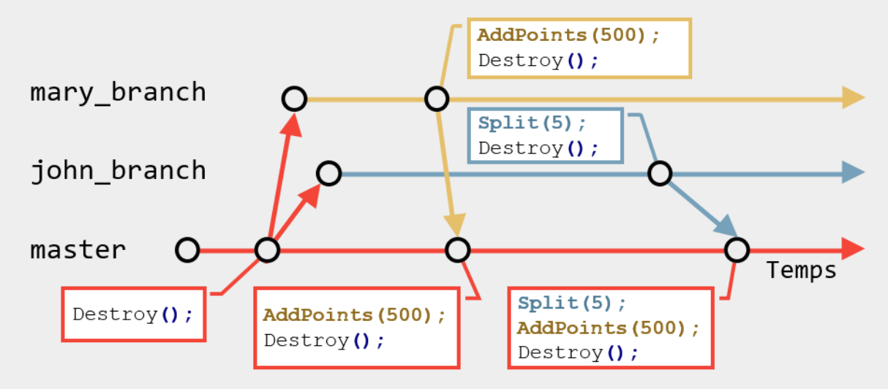
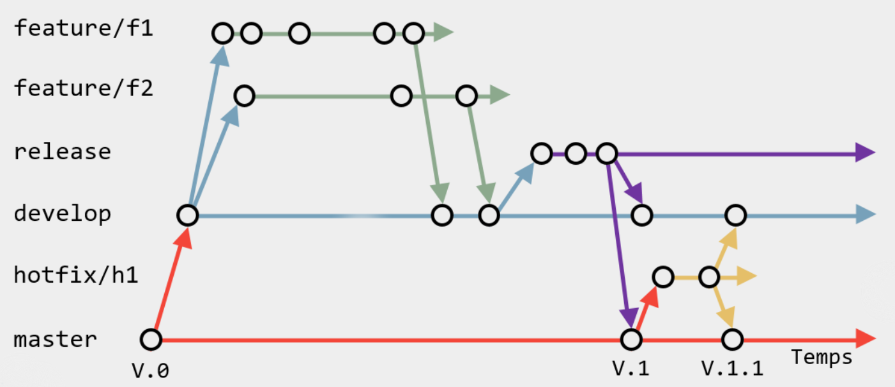
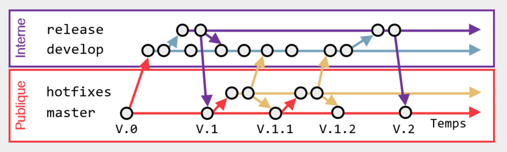
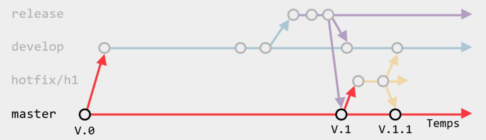
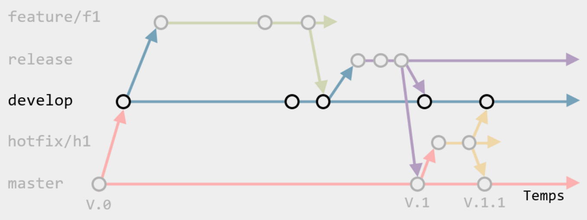
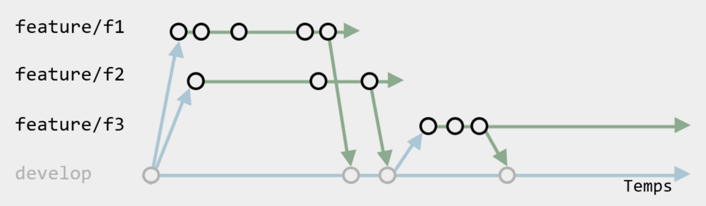
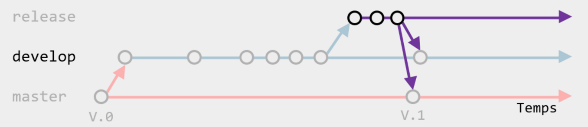
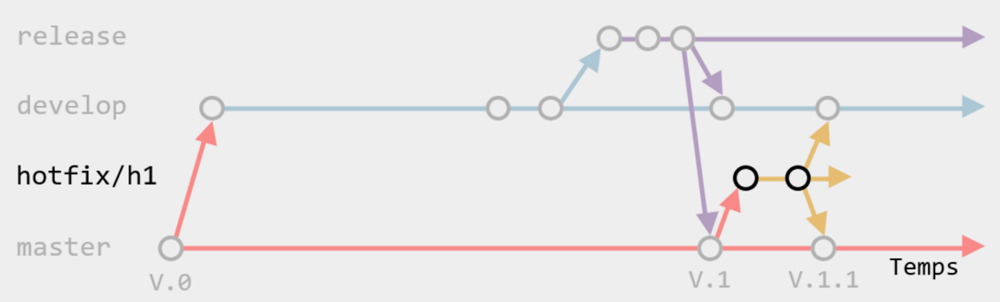

Ce projet utilise les *feature branches* pour structurer le dépôt. Il est de la responsabilité des développeurs de respecter
et d'utiliser ce concept pour chaque ajout au dépôt. 

>>>

**Sommaire**

[[_TOC_]]

>>>

## Résumé

Les *feature branches* consistent à développer chaque nouvelle fonctionnalité dans une branche dédiée au lieu de la branche 
principale. Cette séparation permet à chaque développeur de travailler sur sa propre fonctionnalité sans perturber le travail
des autres. Cela signifie également que la branche principale ne contiendra jamais de code temporaire.

## Les numéros de version

Avant toute chose, il est important de comprendre les trois types de versions : 

 * les *versions majeures*
 * les *versions mineures*
 * les *révisions*

Les **versions majeures** sont des livrables importants, souvent causés par des changements architecturaux ou technologiques. Elles 
changement le premier chiffre dans le numéro de version. Par exemple : `1.0.0` et `2.0.0`.

Les **versions mineures** sont des livraisons de moindre importance, faisant usage de l'architecture actuelle pour ajouter des 
fonctionalitées. Elles changement le second chiffre dans le numéro de version. Par exemple : `1.0.0` et `1.1.0`.

Les **révisions** sont des corrections apportées à une version mineure. Elles visent à corriger des bogues importants au logiciel
livré. Elles changement le troisième chiffre dans le numéro de version. Par exemple : `1.1.1` et `1.1.2`.

## Les *feature branches* et le *GitFlow*

*GitFlow* est une idée introduite par [Vincent Driessen](http://nvie.com/posts/a-successful-git-branching-model/) comme une 
extension des *feature branches*.

En *GitFlow*, plusieurs branches avec un but bien précis sont prédéfinies. Ces branches compartimentent le développement et
prescrisent une séquence bien précise des événements.

Cette procédure est généralement appropriée pour tout développemnt de type *point-release* (livraisons à dates fixes) où deux
versions du logiciel doit être maintenues par les dévelopeurs : la version livrée (ou publique), où des *hotfix* doivent être 
faits pour corriger les bogues importants, et la version en cours de développement (ou interne), où les nouvelles 
fonctionalitées sont créées.

### La branche *Master*

La branche `master` contient la dernière version stable. Elle est est considérée comme *livrable* et aucun développement 
n'est fait directement dans cette branche. Chaque révision livrable est généralement étiquettée d'une numéro de version (tel
que `1.0.0`).

### La branche *Develop*

La branche `develop` contient la toute dernière version. Elle n'est pas suffisamment stable pour être livrable et aucun
développement de nouvelle fonctionalité n'est fait dans cette branche.

### Les branches _Feature/**_

Ces branches sont créées à partir de la branche `develop`. Il y a une branche pour fonctionalitée et lorsqu'une fonctionalité
est complétée, elle est fusionnée dans la branche `develop`.

### La branche *Release*

Lorsqu'un *milestone* est atteint, la branche `develop` est fusionnée dans la branche `release`. Cette branche est considérée 
*feature-complete* : aucune nouvelle fonctionalité n'y est ajouté, uniquement des corrections. Une fois stable, elle est 
fusionnée dans la branche `master` (pour y créer une version majeure ou mineure) ainsi que la branche `develop` (pour y 
reporter les corrections). 

### Les branches _*Hotfix/**_

Ces branches sont créées à partir de la branche `master`. Elles visent à corriger les bogues importants des versions 
ivrées. Elles sont fusionnée dans la branche `master` (pour y créer une révision) ainsi que la branche `develop` (pour
y reporter les corrections). 

